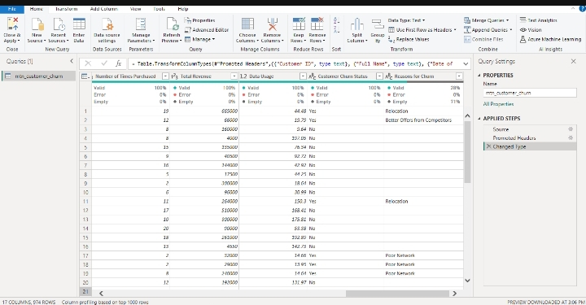
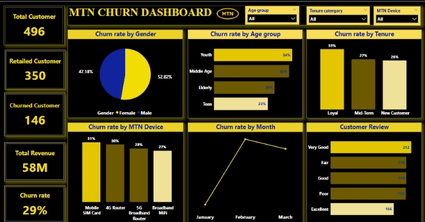

# MTN-CHURN-ANALYSIS-

## 📑 Table of Contents
- [Description](#description)
  
- [Overview](#overview)
  
- [Problem Statement](#problem-statement)
  
- [Objective](#objective)
 
- [Key areas analyzed]()

- [Data Source]()

- [Data Description]()
  
- [Tools Used](#tools-used)

- [Data cleaning]()
  
- [Analysis and visualization]()
  
- [Dashboard](#dashboard)
 
- [Key metrics]()
  
- [Insights Gained](#insights-gained)
  
- [Recommendation](#recommendation)
  
- [Contact](#contact)

## 📄 Description
This project presents an interactive dashboard for MTN's customer churn analysis. It explores trends and patterns in customer behavior, retention, and churn across different categories including age, tenure, device usage, and customer feedback.

## 📌 Project Overview
Understanding churn patterns is vital for improving customer retention and maximizing revenue. This dashboard visualizes churn metrics from 974 MTN customers to identify areas for targeted interventions.

## ❓ Problem Statement
MTN is experiencing a 29% customer churn rate, which may affect profitability, customer lifetime value, and brand loyalty. Identifying the key churn drivers is essential for building retention strategies.

## 🎯 Objective
1️⃣ To analyze churn trends across demographics, tenure, devices, and customer reviews  

2️⃣ To derive actionable, data-driven insights  

3️⃣ To recommend effective strategies to reduce churn

4️⃣ Support business decisions through easy-to-understand visuals

## 📊 Key Areas Analysed
📍 Gender-based churn rate  

📍 Age group-wise churn  

📍 Tenure category churn behavior  

📍 Device-specific churn analysis  

📍 Churn trend over months  

📍 Customer review patterns
  

## 📚 Data Source

The dataset was obtained from kaggle website

Here's the link to the dataset:[LINK](#https://www.kaggle.com/datasets/nextmillionaire/pizza-sales-dataset)

## 🧾 Dataset Description
This dataset contains 974 rows of customer entries and the following columns

| **Column Name**              | **Description**                                                                                                                                  |
|-----------------------------|--------------------------------------------------------------------------------------------------------------------------------------------------|
| `Customer ID`               | A unique identifier assigned to each customer. May appear more than once if the customer owns multiple devices.                                 |
| `Full Name`                 | Full name of the customer. Names are representative of various Nigerian ethnicities and regions.                                                  |
| `Date of Purchase`          | Month and year the device or plan was purchased. All entries are from the year **2025**.                                                         |
| `Age`                       | Age of the customer (ranges from **16 to 80**). Influences purchasing behavior.                                                                  |
| `State`                     | Nigerian state where the customer resides, including the **FCT**.                                                                                |
| `MTN Device`                | Device purchased by the customer. Includes: **Mobile SIM Card**, **Broadband MiFi**, **4G Router**, **5G Broadband Router**.                     |
| `Gender`                    | Gender of the customer (**Male** or **Female**).                                                                                                 |
| `Satisfaction Rate`         | A score from **0 to 5** reflecting the customer’s satisfaction level.                                                                            |
| `Customer Review`           | Categorical review of experience: **Poor**, **Fair**, **Good**, **Very Good**, **Excellent**.                                                    |
| `Customer Tenure in months` | How long the customer has been subscribed (in months).                                                                                           |
| `Subscription Plan`         | The name of the MTN data plan purchased (e.g., **60GB Monthly Broadband Plan**, **7GB Monthly Plan**, etc.).                                     |
| `Unit Price`                | Cost of the data plan in **Nigerian Naira (₦)**.                                                                                                 |
| `Data Usage`                | Estimated data usage in **gigabytes (GB)**. Not necessarily equal to plan size—it reflects actual usage behavior.                               |
| `Number of Times Purchased` | How many times the plan was purchased within the month (simulates usage/consumption frequency).                                                  |
| `Total Revenue`             | Total amount spent by the customer (**Unit Price × Number of Times Purchased**).                                                                 |
| `Customer Churn Status`     | Indicates whether the customer has churned (**Yes**) or is still active (**No**).                                                                |
| `Reasons for Churn`         | If churned, shows the reason (e.g., **Poor Network**, **Relocation**, **High Call Tariffs**, etc.). Empty for active customers.                  |

## 🛠️ Tools Used
- **Power BI** – for data cleaning, interactive dashboards and visualizations 

## 🧹 Data Cleaning

📍 All columns were **well-structured** and formatted for analysis.  

📍 The **“Reason for Churn”** column had **71% missing values**, and it was **dropped** to avoid skewing the analysis.  

📍 For deeper insights, the **Age** column was classified into defined categories **Teens (13–19)**, **Youth (20–35)**, **Middle Age (36–55)**, and **Elderly (56+)** to identify churn trends across life stages.  

📍 The **Tenure** column was grouped into segments, **New Customers (0–12 months)**, **Midterm Customers (13–36 months)**, and **Loyal Customers (37+ months)** to analyze retention patterns based on customer longevity.

📍 No other significant data quality issues were found.

## 📈 Dashboard  

## 🔢 Key Metrics Summary

| **Metric**                         | **Value**            | **Insight**                                                                 |
|-----------------------------------|----------------------|------------------------------------------------------------------------------|
| Total Customers                   | 496                  | Total number of unique customers analyzed                                   |
| Retained Customers                | 350                  | Customers who are still active                                              |
| Churned Customers                 | 146                | Customers who stopped using MTN services                                    |
| Overall Churn Rate                | 29%                  | Percentage of churned customers                                             |
| Total Revenue                     | ₦58,000,000          | Revenue generated from data purchases                                       |

## 📊 Insights gained 
### 1️⃣ Gender

**Males** have a slightly **higher churn rate (52.82%)** compared to **females (47.18%)**, suggesting gender-targeted strategies may be relevant.

### 2️⃣ Age Group

**Youth (34%)** and **Middle Age (32%)** segments have the **highest churn rates**, **indicating dissatisfaction or competition** affecting these age groups.

**Teens** have the **lowest churn rate at 23%**, suggesting **higher loyalty**.

### 3️⃣ Tenure

**Loyal customers** surprisingly have the **highest churn rate (33%)** vs. **Mid-term (27%)** and **New Customers (26%)**, indicating that **long-term users** may lack sustained **value or engagement**.

### 4️⃣ MTN Device

**Highest churn rates** are associated with **Mobile SIM cards (31%)** and **4G Routers (30%)**, hinting at **device performance or service issues**.

**Broadband MiFi** users show the **lowest churn at 27%**.

### 5️⃣ Monthly Trend

**Churn peaked in February**, suggesting **seasonality or operational disruptions** during that period.

### 6️⃣ Customer Reviews

Most customers rate their experience as **"Very Good" (212) or "Fair" (199)**, but **"Excellent" ratings (166)** are fewer, signaling room for improvement.

A notable number of users gave **"Poor" (169)** and **"Fair"** reviews correlating with churn trends.

## ✍️ Recommendations
1️⃣ **Target Youth and Middle-Aged Customers**: Develop engagement campaigns or loyalty programs to retain these high-risk segments.

2️⃣ **Investigate Churn Among Loyal Customers:** Conduct qualitative feedback collection to understand why long-term users are leaving.

3️⃣ **Improve Device Performance**: Review issues related to Mobile SIMs and 4G routers consider bundling with better support or promotions.

4️⃣ **Boost Customer Satisfaction**: Encourage more "Excellent" experiences through customer support, feedback loops, and service quality improvements.

5️⃣ **Analyze February Churn Spike**: Deep dive into operations or external factors during February that could have triggered the increase in churn.

## 👩🏽‍💻 Contact:
Created by: **Ajirola Amudat**  
_Data Analyst | Power BI Enthusiast_

📧 For collaboration or inquiries, connect with me on [LinkedIn](https://www.linkedin.com/in/ajirola-amudat-a-3083882b2?utm_source=share&utm_campaign=share_via&utm_content=profile&utm_medium=android_app)

